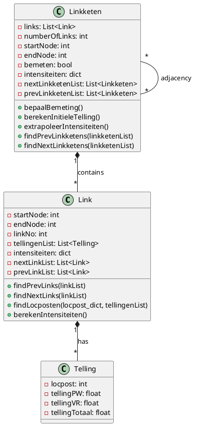
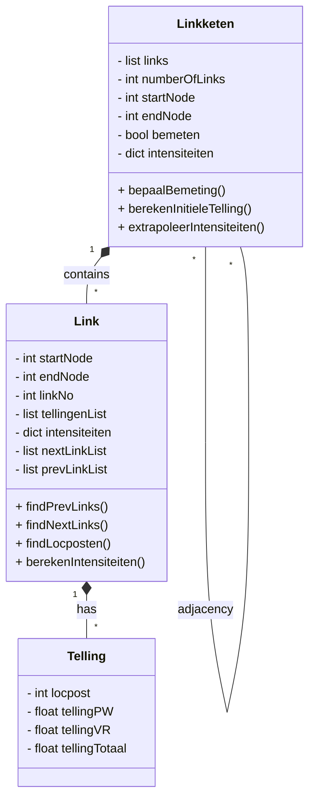

# Projectdocumentatie — Validatie algoritme

Deze documentatie beschrijft de bestanden en klassen in het project dat bedoeld is om tellingen op weglinks te koppelen en intensiteiten voor linkketens te extrapoleren.

## Bestandsoverzicht

- `algoritme.py` — Hoofdscript dat data inleest (nodes, links, locposten, tellingen), Link-objecten en Linkketen-objecten aanmaakt en de extrapolatie-loop uitvoert.
- `functies.py` — Hulpfuncties:
  - `findStartLinks(linkList)` — bepaalt welke links startpunten zijn voor linkketens.
  - `createLinkKetens(startLinks)` — bouwt `Linkketen` objecten vanaf de startlinks.
- `klasseDefinities.py` — Definitie van de gebruikte dataklassen:
  - `Link`
  - `Linkketen`
  - `Telling`

## Kort overzicht van de dataflow

1. In `algoritme.py` worden shapefiles en CSV geladen via `geopandas` / `pandas`.
2. `links` wordt omgezet in een lijst van `Link` objecten (`linkList`).
3. `tellingen` wordt omgezet in een lijst van `Telling` objecten (`tellingenList`).
4. Locposten per `linkNo` worden samengevoegd in een dictionary en aan de juiste `Link` gekoppeld.
5. Per `Link` worden vorige/volgende links gezocht, en intensiteiten (gemiddelden) berekend.
6. `startLinks` worden bepaald en met `createLinkKetens` worden `Linkketen` objecten aangemaakt.
7. Er wordt een iteratieve loop gedraaid die zich herhaalt zolang er updates zijn in de `Linkketen`-intensiteiten; extrapolatie gebruikt bemeten aangrenzende ketens.

## Klassen: contract, attributen en methoden

Hieronder staat per klasse een korte contract-achtige beschrijving (inputs / outputs / succes & fouten).

### Link
- Input (constructor): `startNode`, `endNode`, `linkNo` (in code: `__init__(self, startNode2, endNode, linkNo)`).
- Belangrijkste attributen:
  - `startNode` (node id waarop de link begint)
  - `endNode` (node id waarop de link eindigt)
  - `linkNo` (link identifier)
  - `tellingenList` (lijst van `Telling` objecten gekoppeld aan deze link)
  - `intensiteiten` (dict met keys `"PW"`, `"VR"`, `"Totaal"`)
  - `nextLinkList`, `prevLinkList`
- Belangrijkste methoden:
  - `findPrevLinks(linkList)` — vult `prevLinkList` met links waarvoor `link.endNode == self.startNode`.
  - `findNextLinks(linkList)` — vult `nextLinkList` met links waarvoor `link.startNode == self.endNode`.
  - `findLocposten(locpost_dict, tellingenList)` — zoekt locpost-codes in `locpost_dict` en koppelt `Telling` objecten.
  - `berekenIntensiteiten()` — berekent gemiddelde intensiteiten als `tellingenList` niet leeg is.

Contract / verwachte fouten:
- Als `tellingenList` leeg is, blijven de intensiteiten `None`.
- Let op: in de huidige broncode is het constructor-argument `startNode2` genoemd, terwijl de rest van de code `startNode` verwacht. Dit veroorzaakt buggy gedrag (AttributeError bij gebruik van `self.startNode`). Zie 'Verbeteringen' onderaan.

### Linkketen
- Input: `links` — lijst van `Link` objecten die achtereenvolgend verbonden zijn.
- Attributen:
  - `links` (lijst van `Link`)
  - `numberOfLinks` (aantal links)
  - `startNode`, `endNode`
  - `bemeten` (bool: bevat keten minstens één link met tellingen)
  - `intensiteiten` (dict: `PW`, `VR`, `Totaal`, `Invulling`)
  - `nextLinkketenList`, `prevLinkketenList`
- Belangrijke methoden:
  - `bepaalBemeting()` — zet `bemeten` als één van de links tellingen heeft.
  - `berekenInitieleTelling()` — berekent gemiddelde intensiteiten over de links die tellingen hebben.
  - `extrapoleerIntensiteiten()` — indien keten niet `bemeten`, probeert op basis van volledig bemeten aangrenzende ketens de intensiteiten in te vullen.
  - `findPrevLinkketens(linkketenList)` / `findNextLinkketens(linkketenList)` — zoekt aangrenzende ketens obv start/end nodes.

Contract / randvoorwaarden:
- `extrapoleerIntensiteiten()` keert `1` terug als er een update is gedaan, anders `0`. De hoofdloop telt updates om te bepalen of er nog werk is.
- De extrapolatie gebruikt simpele optelling / gemiddelden en houdt niet expliciet rekening met dichtheid of splitsingsratio's; dat kan tot onnauwkeurigheden leiden in vertakkende netwerken.

### Telling
- Input: `locpost`, `tellingPW`, `tellingVR`
- Attributen: `locpost`, `tellingPW`, `tellingVR`, `tellingTotaal` (som)

Contract:
- Een `Telling` is een eenvoudige container die in `Link.findLocposten` gekoppeld wordt aan links.

## UML klasse diagram

Onderstaand zie je twee weergaven: PlantUML en Mermaid. Je kunt deze code kopiëren naar een PlantUML- of Mermaid-renderer om een plaatje te genereren.

### PlantUML (bron)



### Mermaid (bron)



## Hoe `algoritme.py` draait (kort)

Benodigde pakketten (indicatie):
- Python 3.8+ (aanbevolen 3.10+)
- pandas
- geopandas
- fiona, shapely, pyproj (door geopandas afhankelijkheden)

Voor Windows PowerShell, voorbeeldcommando's:

```powershell
# (optioneel) maak virtuele omgeving
python -m venv .venv; .\.venv\Scripts\Activate.ps1

# installeer requirements (voorbeeld)
pip install pandas geopandas

# run het script (zorg dat paden in algortime.py correct zijn)
python .\algoritme.py
```

Let op: het script verwijst naar `root = r"E:/v423_ONTW_SPM/04 Diverse onderzoeken/34 Gesloten wegvakprobleem/"`. Pas dit pad aan naar jouw omgeving of zet de data op dat pad.

## Bekende issues en suggesties (kleine fixes)

1. Attribuutnaam mismatch in `klasseDefinities.py`:
   - Probleem: `Link.__init__` gebruikt parameternaam `startNode2` en zet `self.startNode2`, maar de rest van de code (methoden en `functies.py`) verwijst naar `self.startNode`.
   - Effect: bij runtime wordt `self.startNode` niet gevonden en leidt dat tot een AttributeError.
   - Oplossing (veilig, klein): wijzig de constructor in `klasseDefinities.py` naar:
     ```py
     def __init__(self, startNode, endNode, linkNo):
         self.startNode = startNode
         self.endNode = endNode
         self.linkNo = linkNo
         ...
     ```
   - Dit is een eenvoudige, backwards-compatible correctie aangezien de rest van de code `startNode` verwacht.

2. Robustheid: controleer op duplicate links en cirkelstructuren
   - Links die een cirkel vormen (A->B->C->A) worden niet opgenomen in een `Linkketen` en eindigen als `links_not_in_ketens`. Documenteer of dit gewenst is. Als niet gewenst, kun je detectie van cycli toevoegen en een policy bepalen (halte, markeer als lus, zoek kortste pad, etc.).

3. Extrapolatiemodel: momenteel is de extrapolatie eenvoudig (optelling/gemiddelde). Bij vertakkingen kan dit leiden tot foutieve uitkomsten. Mogelijke verbeteringen:
   - Introduceer splitting-ratio's gebaseerd op verkeer of historische data.
   - Gebruik een gewogen gemiddelde op basis van aantal rijstroken of wegklasse (indien beschikbaar).

4. Type hints en tests
   - Voeg type hints toe aan klassen en functies.
   - Schrijf minimaal 2–3 unit tests: construeren van `Link` met locposten; bouwen van eenvoudige keten en extrapolatie; detectie van cirkel.

## Contract (korte samenvatting)

- Ingangen: shapefiles (`MASTER_*`) en CSV met tellingen; paden hard-coded in `algoritme.py`.
- Uitgangen: console logging van aantal ketens, aantal updates en per-keten prints; er is geen exportbestand in huidige code — als gewenst kan een CSV of GeoPackage met resultaten toegevoegd worden.

## Edge cases

- Links zonder locposten/tellingen: blijven `None` tot extrapolatie.
- Netwerkknooppunten met meerdere in- of uitgaande links: bepalen startlinks en ketens zoals beschreven — maar resultaten zijn gevoelig voor netwerktopologie.
- Cyclische subgrafen: links in lussen worden niet in ketens opgenomen en worden apart gelogd.

## Voorstel: minimale `requirements.txt`

```
pandas>=1.3
geopandas>=0.10
fiona
shapely
pyproj
```

(Optimaliseer versies naar je omgeving; geopandas kan specifieke versies van dependencies vereisen op Windows.)

## Volgende stappen / aanbevolen acties

- [ ] (Optioneel) Wil je dat ik de kleine bugfix in `klasseDefinities.py` (rename `startNode2` -> `startNode`) automatisch doorvoer? Dit is een veilige één-regel wijziging.
- [ ] (Optioneel) Wil je dat ik een `requirements.txt` toevoeg en een korte test (pytest) schrijf om de belangrijkste functies te valideren?
- [ ] (Optioneel) Wil je dat ik een PNG/SVG genereer van de PlantUML (daarvoor is internet of een lokale PlantUML installatie nodig) — ik kan de PlantUML/mermaid bron plaatsen en instructies geven hoe je afbeelding lokaal rendert.

---

Kort overzicht: dit bestand geeft een compacte referentie voor de code in `algoritme.py`, `functies.py` en `klasseDefinities.py`, inclusief twee bronformaten van het klasse diagram. Als je wilt, kan ik nu één van de voorgestelde acties uitvoeren (bugfix, requirements toevoegen of tests schrijven).